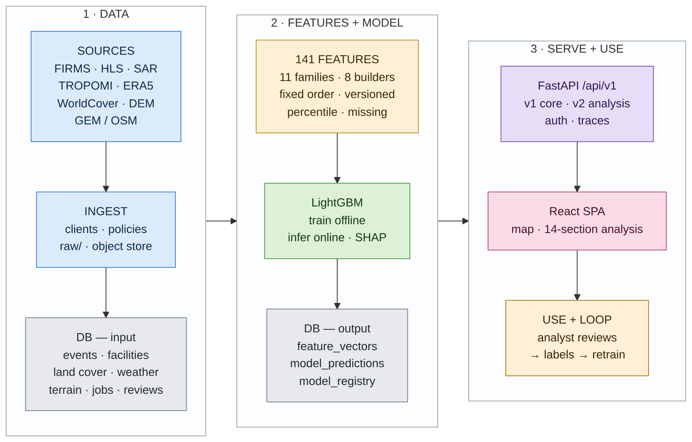
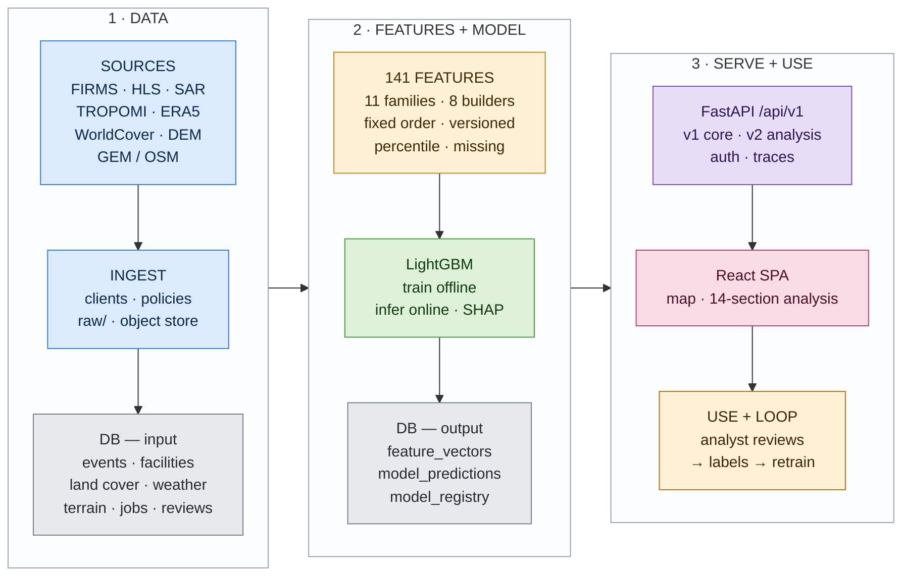

# AGNI-NETRA — Application Architecture

One diagram for one slide. Sources by name, then the pipeline: ingest → store → 141
features → model → store → serve → use → back into training.



## Mermaid code



## Files

| File | What it is |
| --- | --- |
| `architecture-flow-diagram.mmd` | The source. Edit this. |
| `architecture-flow-diagram.png` | 2679 × 1713, exported from the `.mmd`. |
| `architecture-flow-diagram.md` | This file. |

## On the slide

1.56:1, so it drops into a half-slide box (6.6 × 3.7 in) with room to spare, and still fits a
full slide. Re-export after editing:

```bash
npx -y @mermaid-js/mermaid-cli@11 \
  -i docs/architecture-flow-diagram.mmd \
  -o docs/architecture-flow-diagram.png -b white -s 3
```

**Three traps if you edit the code**

1. The `%%{init: ...}%%` line is required. `wrappingWidth: 300` is what keeps the boxes narrow
   and the whole diagram compact; without it Mermaid re-wraps at 200 px and it collapses.
2. `-s 3` is required. mermaid-cli silently scales the render into its 800 px viewport, so
   without `-s` you get an 800 px image. `-w` does nothing.
3. No backwards edges. A back edge (e.g. `C3 -.-> B1`) makes the three columns a cycle and
   the layout falls apart, which is why the analyst loop is a labelled last step instead of a
   drawn arrow. Stage links are `A --> B --> C` between subgraphs — a node-level
   cross-subgraph edge disables the inner `direction TB` and boxes spill out sideways.

No SVG on purpose: Mermaid draws labels as `foreignObject`, which PowerPoint renders blank.

## Reading the flow

**1 · DATA** — nine source families pulled by thin clients, parsed, de-duplicated, clustered,
cloud-masked and quality-gated. Raw payloads and rasters to the object store; typed rows into
PostGIS as geometry, which is what makes `ST_DWithin` and `ST_Distance` ordinary queries.

**2 · FEATURES + MODEL** — eight builders turn one event into 141 features in 11 families, in
a fixed column order, versioned, each with a percentile and a missing flag. Stored in
`feature_vectors`. LightGBM then scores it — trained offline on a cluster, served online from
one `model.bin` — and class, confidence, status and SHAP are stored with the model version.

**3 · SERVE + USE** — FastAPI serves the v1 core and frozen v2 analysis contracts; the React
app turns them into the command map and the 14-section analysis workspace. Exports and the CAP
draft hand work to a human, and the analyst's verdict closes the loop: reviews become labels,
labels become the next training set, which re-enters at **141 FEATURES**.

## Rules it encodes

- Raw, derived and model-output data live in different tables and different layers.
- Every prediction stores the model version and the feature-set version, so it is auditable.
- Missing data returns `missing: true` / `null`, never zero.
- Fire spread is computed only for wildfire and crop burning, and is labelled "Indicative".
- The CAP alert is a Restricted draft and transmits nothing.
- Ingestion, features and prediction run in workers, so no long job blocks an API request.
- A class is never shown without its confidence.
